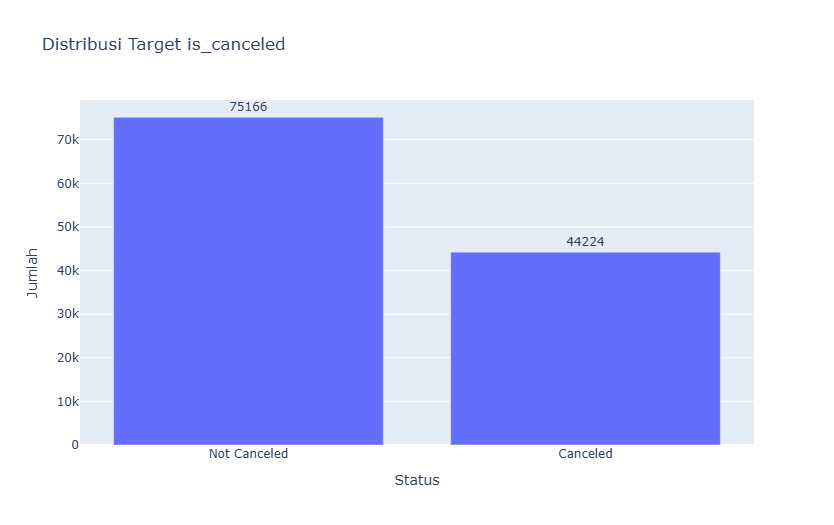
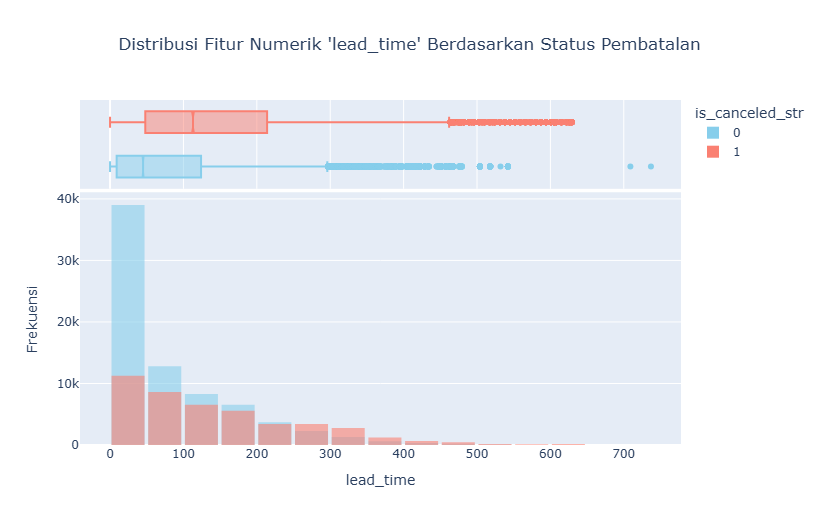
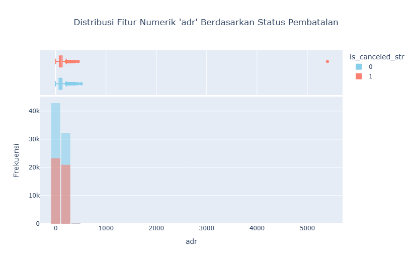
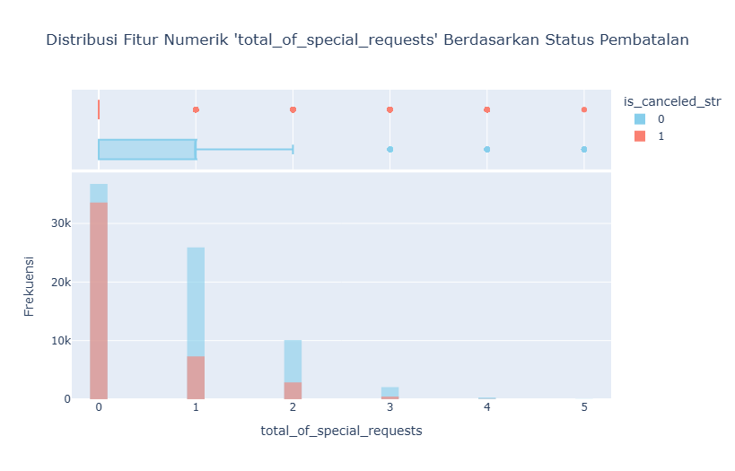
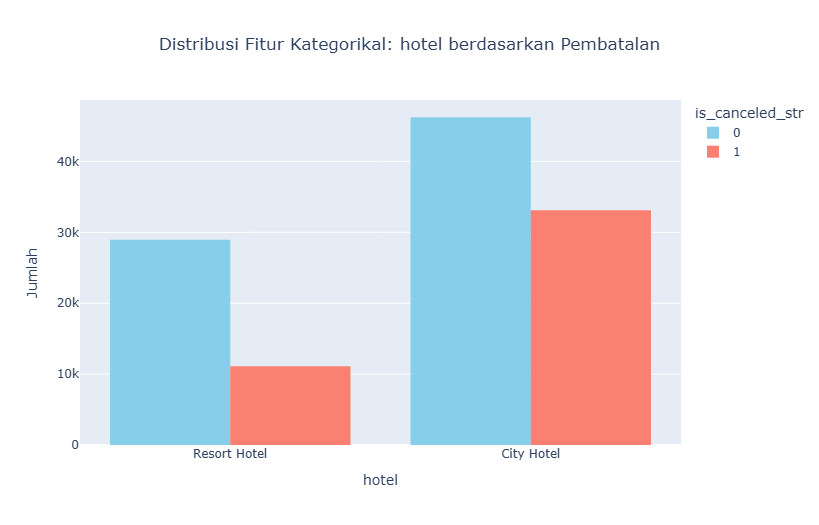
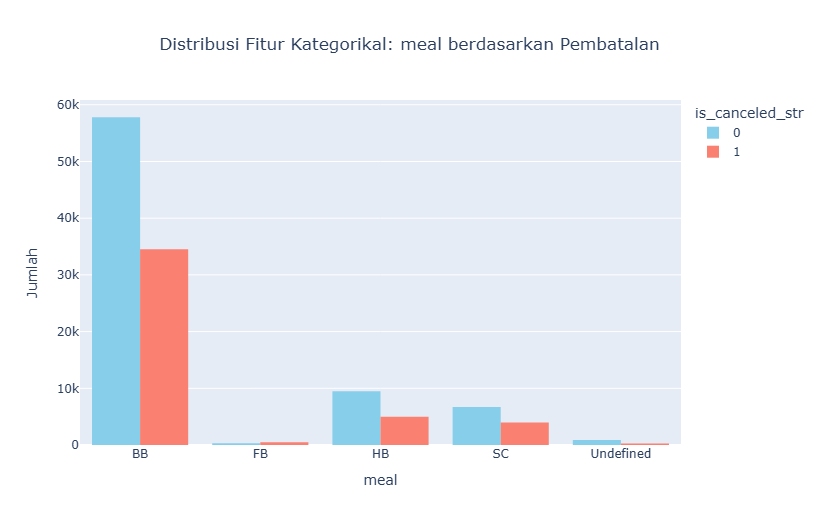
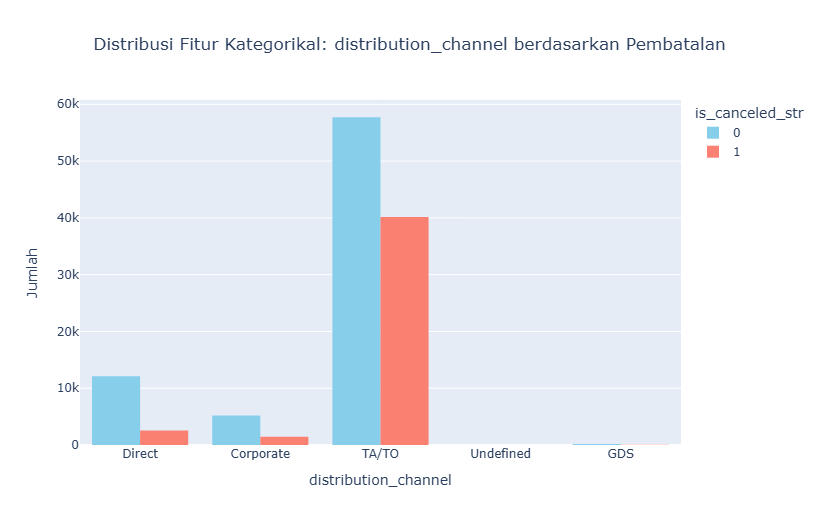
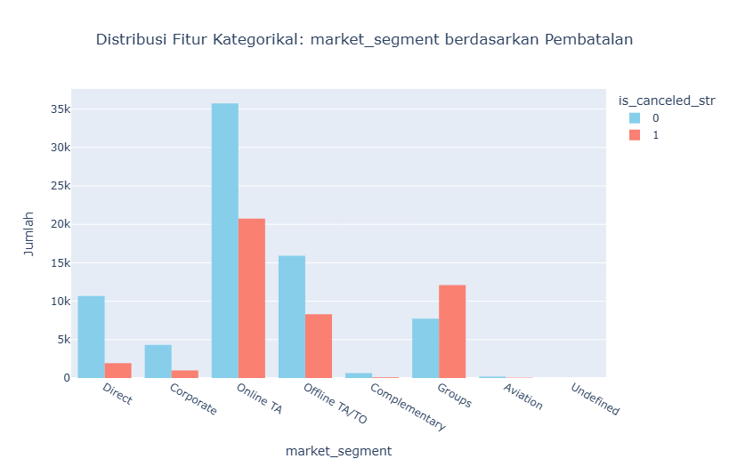

# Laporan Proyek Machine Learning - Arum Puspadewi

## Domain Proyek

Sudah tidak dapat dimungkiri lagi bahwa pembatalan reservasi oleh pelanggan merupakan salah satu tantangan utama dalam industri perhotelan yang dapat menimbulkan kerugian finansial dan gangguan operasional. Seiring dengan meningkatnya jumlah pemesanan online, penting untuk memprediksi apakah reservasi akan dibatalkan, agar pihak hotel bisa mengambil langkah proaktif seperti overbooking atau promosi ulang. Oleh karena itu, berbagai penelitian telah dilakukan untuk membangun sistem prediksi yang andal dengan memanfaatkan teknik pembelajaran mesin.

Salah satu penelitian terbaru dilakukan oleh Bhardwaj et al. (2024), yang mengembangkan sistem prediksi pembatalan reservasi hotel menggunakan berbagai teknik machine learning seperti Logistic Regression, Decision Tree, Random Forest, Gradient Boosting, SVM, dan Artificial Neural Network (ANN). Mereka menunjukkan bahwa ANN menghasilkan performa terbaik dengan akurasi 99,02%, sehingga sistem ini dapat diintegrasikan secara real-time untuk membantu manajemen hotel dalam pengambilan keputusan operasional secara data-driven. [1]

Penelitian serupa juga dilakukan oleh Qureshi dan Menezes (2023), yang menggunakan algoritma J48 Tree, Naive Bayes, Logistic Function, dan Random Forest melalui platform Weka. Hasil penelitian mereka menyimpulkan bahwa algoritma Random Forest adalah yang paling sesuai dalam memprediksi pembatalan berdasarkan metrik evaluasi seperti akurasi, sensitivitas, dan lift. [3]

Sementara itu, Satu et al. (2020) fokus pada analisis performa berbagai teknik machine learning dengan melakukan transformasi fitur dan seleksi fitur terlebih dahulu. Studi mereka menunjukkan bahwa XGBoost merupakan metode yang paling konsisten memberikan hasil terbaik, terutama saat dikombinasikan dengan teknik seleksi fitur berbasis information gain. [2]

Ketiga penelitian tersebut memperkuat pentingnya pendekatan machine learning dalam memahami dan mengelola risiko pembatalan reservasi hotel secara efektif.

## Business Understanding

### Problem Statements

- Apakah pelanggan akan membatalkan reservasi hotelnya?
- Fitur apa yang paling memengaruhi pembatalan reservasi?
- Bagaimana cara meningkatkan akurasi prediksi pembatalan?

### Goals

- Memprediksi probabilitas pembatalan pemesanan.
- Mengidentifikasi fitur paling berpengaruh dalam keputusan pembatalan.
- Menemukan model prediktif terbaik.

### Solution Statements

- Melakukan prediksi dengan algoritma machine learning.
- Mengukur performa dengan akurasi, precision, recall, dan F1-score.
- Menggunakan beragam algoritma (Random Forest, ANN, dan XGBoost).

## Data Understanding
Dataset ini berisi 119.390 data dengan 32 fitur yang berupa informasi pemesanan untuk hotel kota dan hotel resor, dan mencakup informasi seperti waktu pemesanan, lama menginap, jumlah orang dewasa, anak-anak, dan/atau bayi, serta jumlah tempat parkir yang tersedia. [Hotel booking demand](https://www.kaggle.com/datasets/jessemostipak/hotel-booking-demand). 

Beberapa poin penting mengenai kondisi awal dataset terebut:
- **Tipe Data**
  - 20 Fitur Numerikal, yaitu:
    -  ```is_canceled```
    -  ```lead_time```
    -  ```arrival_date_year```
    -  ```arrival_date_week_number```
    -  ```arrival_date_day_of_month```
    -  ```stays_in_weekend_nights```
    -  ```stays_in_week_nights```
    -  ```adults```
    -  ```children```
    -  ```babies```
    -  ```is_repeated_guest```
    -  ```previous_cancellations```
    -  ```previous_bookings_not_canceled```
    -  ```booking_changes```
    -  ```agent```
    -  ```company```
    -  ```days_in_waiting_list```
    -  ```adr```
    -  ```required_car_parking_spaces```
    -  ```total_of_special_requests```
  - 12 Fitur Kategorikal, yaitu:
    -  ```hotel```
    -  ```arrival_date_month```
    -  ```meal```
    -  ```country```
    -  ```market_segment```
    -  ```distribution_channel```
    -  ```reserved_room_type```
    -  ```assigned_room_type```
    -  ```deposit_type```
    -  ```customer_type```
    -  ```reservation_status ```
    -  ```reservation_status_date```

- **Missing Values**
  - Kolom ```agent``` dan ```company``` memiliki cukup banyak nilai kosong, sehingga dipertimbangkan untuk dihapus.
  - Kolom ```children``` dan ```country``` memiliki nilai kosong yang cukup rendah. Karena umumnya lebih sering tamu jarang membawa anak, maka nilai kosong pada kolom ```children``` akan diisi nol. Sementara nilai kosong pada kolom ```country``` akan diisi oleh nilai dengan jumlah terbanyak.

- **Data Duplikat**
  
  Ditemukan sebanyak 3.195 baris duplikat dalam data.

- **Data Outlier**

  Ditemukan adanya outlier pada beberapa fitur, yaitu:
  - ```lead_time```: 3005
  - ```stays_in_weekend_nights```: 265
  - ```stays_in_week_nights```: 3354
  - ```adults```: 29710
  - ```children```: 8590
  - ```babies```: 917
  - ```is_repeated_guest```: 3810
  - ```previous_cancellations```: 6484
  - ```previous_bookings_not_canceled```: 3620
  - ```booking_changes```: 18076
  - ```days_in_waiting_list```: 3698
  - ```adr```: 3793
  - ```required_car_parking_spaces```: 7416
  - ```total_of_special_requests```: 2877

### Variabel-variabel pada Hotel booking demand dataset adalah sebagai berikut:
- hotel : Jenis Penginapan (H1 = Hotel Resor or H2 = Hotel Kota)
- is_canceled : Nilai yang menunjukkan apakah pemesanan dibatalkan (1) atau tidak (0)
- lead_time : Jumlah hari yang telah berlalu antara tanggal masuknya pemesanan ke dalam PMS dan tanggal kedatangan
- arrival_date_year : Tahun dari tanggal kedatangan
- arrival_date_month : Bulan dari tanggal kedatangan
- arrival_date_week_number : Minggu dari tanggal kedatangan
- arrival_date_day_of_month : Hari dari tanggal kedatangan
- stays_in_weekend_nights : Jumlah malam akhir pekan (Sabtu atau Minggu) tamu menginap atau memesan untuk menginap di hotel
- stays_in_week_nights : Jumlah malam dalam seminggu (Senin hingga Jumat) tamu menginap atau memesan untuk menginap di hotel
- adults : Jumlah orang dewasa
- children : Jumlah anak-anak
- babies : Jumlah bayi
- meal : Jenis makanan yang dipesan. Kategori disajikan dalam paket makanan standar perhotelan: Tidak ditentukan/SC - tidak ada paket makanan; BB - Tempat Tidur & Sarapan; HB - Setengah harga (sarapan dan satu kali makan lainnya - biasanya makan malam); FB - Harga penuh (sarapan, makan siang, dan makan malam)
- country : Negara asal. Kategori diwakili dalam format ISO 3155-3:2013
- market_segment : Penunjukan segmen pasar. Dalam kategori, istilah “TA” berarti “Agen Perjalanan” dan ‘TO’ berarti “Operator Tur”
- distribution_channel : Saluran distribusi pemesanan. Istilah “TA” berarti “Agen Perjalanan” dan ‘TO’ berarti “Operator Tur”
- is_repeated_guest : Nilai yang menunjukkan apakah nama pemesanan berasal dari tamu berulang (1) atau tidak (0)
- previous_cancellations : Jumlah pemesanan sebelumnya yang dibatalkan oleh pelanggan sebelum pemesanan saat ini
- previous_bookings_not_canceled : Jumlah pemesanan sebelumnya yang tidak dibatalkan oleh pelanggan sebelum pemesanan saat ini
- reserved_room_type : Kode jenis kamar yang dipesan. Kode disajikan sebagai pengganti sebutan untuk alasan anonimitas.
- assigned_room_type : Kode untuk jenis kamar yang ditetapkan untuk pemesanan. Terkadang jenis kamar yang ditetapkan berbeda dengan jenis kamar yang dipesan karena alasan operasional hotel (misalnya pemesanan berlebih) atau atas permintaan pelanggan. Kode disajikan sebagai pengganti sebutan untuk alasan anonimitas.
- booking_changes : Jumlah perubahan/amandemen yang dilakukan pada pemesanan sejak pemesanan dimasukkan pada PMS hingga saat check-in atau pembatalan
- deposit_type : Indikasi apakah pelanggan melakukan deposit untuk menjamin pemesanan. Variabel ini dapat memiliki tiga kategori: Tanpa Deposit - tidak ada deposit yang dilakukan; Non Refund - deposit yang dilakukan senilai total biaya menginap; Dapat Dikembalikan - deposit yang dilakukan dengan nilai di bawah total biaya menginap.
- agent : ID biro perjalanan yang melakukan pemesanan
- company : ID perusahaan/entitas yang melakukan pemesanan atau yang bertanggung jawab untuk membayar pemesanan. ID ditampilkan sebagai pengganti sebutan untuk alasan anonimitas
- days_in_waiting_list : Jumlah hari pemesanan berada dalam daftar tunggu sebelum dikonfirmasi kepada pelanggan
- customer_type : Jenis pemesanan, dengan asumsi salah satu dari empat kategori: Kontrak - ketika pemesanan memiliki jatah atau jenis kontrak lain yang terkait dengannya; Grup - ketika pemesanan terkait dengan grup; Transien - ketika pemesanan bukan bagian dari grup atau kontrak, dan tidak terkait dengan pemesanan transien lainnya; Transien-pihak - ketika pemesanan bersifat transien, tetapi terkait dengan setidaknya pemesanan transien lainnya
- adr : Tarif Harian Rata-Rata yang ditentukan dengan membagi jumlah semua transaksi penginapan dengan jumlah total malam menginap
- required_car_parking_spaces : Jumlah ruang parkir mobil yang dibutuhkan oleh pelanggan
- total_of_special_requests : Jumlah permintaan khusus yang dibuat oleh pelanggan (misalnya tempat tidur kembar atau lantai tinggi)
- reservation_status : Status terakhir pemesanan, dengan asumsi salah satu dari tiga kategori: Dibatalkan - pemesanan dibatalkan oleh pelanggan; Check-Out - pelanggan telah melakukan check-in namun sudah berangkat; Tidak Datang - pelanggan tidak melakukan check-in dan menginformasikan alasannya kepada hotel
- reservation_status_date : Tanggal saat status terakhir ditetapkan. Variabel ini dapat digunakan bersama dengan ReservationStatus untuk memahami kapan pemesanan dibatalkan atau kapan pelanggan check-out dari hotel

### Exploratory Data Analysis
Untuk memahami karakteristik data secara menyeluruh, dilakukan serangkaian tahapan eksplorasi data (Exploratory Data Analysis/EDA).

#### Distribusi Target (is Canceled)
Distribusi nilai target `is_canceled` menunjukkan bahwa sebagian besar reservasi tidak dibatalkan (0), namun terdapat proporsi signifikan yang dibatalkan (1). Ketidakseimbangan ini penting untuk diperhatikan dalam pemodelan prediktif.



#### Heatmap Korelasi Fitur Numerikal
Heatmap ini menunjukkan hubungan korelasi antar fitur numerik.


#### Distribusi Lead Time
Distribusi `lead_time` menunjukkan bahwa mayoritas reservasi dilakukan dalam waktu singkat sebelum tanggal kedatangan, namun terdapat sejumlah besar outlier pada nilai yang tinggi.



#### Distribusi ADR (Average Daily Rate)
Gambar berikut menunjukkan penyebaran nilai `adr`. Terlihat adanya sekelompok outlier dengan nilai ekstrem yang mungkin perlu diproses lebih lanjut.



#### Distribusi Total of Special Requests
Mayoritas tamu tidak memiliki permintaan khusus, sementara sebagian kecil meminta satu atau dua permintaan tambahan. Semakin banyak permintaan khusus, umumnya menunjukkan niat menginap yang lebih tinggi.



#### Distribusi Jenis Hotel
Dataset mencakup dua jenis hotel: City Hotel dan Resort Hotel. City Hotel lebih mendominasi dalam jumlah reservasi, namun keduanya perlu dianalisis secara terpisah karena karakteristik pengunjung dan tingkat pembatalannya bisa berbeda.



#### Distribusi Meal
Sebagian besar pelanggan memilih paket "BB" (bed and breakfast), dengan variasi kecil pada jenis meal lainnya. Preferensi meal dapat merefleksikan motivasi kunjungan dan dapat berpengaruh terhadap pembatalan.



#### Distribusi Channel
Kanal distribusi "TA/TO" (travel agents/tour operators) paling sering digunakan, diikuti oleh kanal langsung. Kanal distribusi bisa menunjukkan tingkat loyalitas atau kepastian pelanggan.



#### Distribusi Market Segment
Sebagian besar reservasi berasal dari segmen "Online TA", yang menunjukkan dominasi pemesanan online. Segmentasi ini penting untuk analisis risiko karena pelanggan online cenderung memiliki perilaku pembatalan yang berbeda dibandingkan pelanggan korporat atau offline.



## Data Preparation
Pada tahap ini, dilakukan serangkaian teknik data preparation untuk memastikan data bersih, relevan, dan siap digunakan untuk proses pemodelan. Berikut adalah tahapan yang dilakukan:

1. **Pemuatan Dataset:**
   Dataset dimuat menggunakan `kagglehub` dari repositori `jessemostipak/hotel-booking-demand`.

2. **Eksplorasi Awal:**
   - Meninjau struktur data (`df.info()` dan `df.describe()`).
   - Meninjau distribusi target (`is_canceled`) untuk melihat keseimbangan kelas.
   - Visualisasi korelasi antar fitur numerik dan distribusi frekuensi fitur numerik serta kategorikal berdasarkan target.

3. **Penanganan Missing Values:**
   - Kolom `children` diisi dengan 0 karena kemungkinan besar merupakan input kosong (tanpa anak).
   - Kolom `country` diisi dengan modus (nilai yang paling sering muncul) karena nilai tersebut kemungkinan besar representatif.

4. **Penghapusan Kolom Tidak Relevan:**
   Kolom `agent`, `company`, `reservation_status`, dan `reservation_status_date` dihapus karena:
   - Memiliki banyak nilai kosong (agent dan company).
   - Tidak tersedia saat prediksi dilakukan (data "status" hanya muncul setelah booking terjadi).

5. **Penghapusan Duplikasi:**
   Baris duplikat dihapus untuk menghindari bias.

6. **Membuat Fitur Baru:**
   Fitur `total_guests` dibuat dari penjumlahan `adults`, `children`, dan `babies`. Baris dengan total tamu = 0 dibuang karena tidak logis.

7. **Encoding Fitur Kategorikal:**
   Label Encoding dilakukan terhadap fitur bertipe objek untuk mengubah kategori menjadi nilai numerik.

8. **Normalisasi:**
   `StandardScaler` digunakan untuk menormalkan fitur numerik agar skala data seragam, terutama penting untuk model ANN.

9. **Penanganan Outlier:**
   Outlier dideteksi dan dibatasi (winsorizing) menggunakan batas IQR (interquartile range) untuk fitur `lead_time`, `adr`, dan `total_of_special_requests`. Tujuannya untuk mengurangi dampak ekstrem terhadap model.

10. **Split Data:**
    Data dibagi menjadi 80% data latih dan 20% data uji menggunakan `train_test_split` dengan stratifikasi terhadap target untuk menjaga distribusi kelas.

## Modeling
Tiga model digunakan dan dibandingkan dalam proyek ini: Random Forest, XGBoost, dan Artificial Neural Network (ANN).

### 1. Random Forest Classifier
- Parameter: `n_estimators=100`, `random_state=42`.
- Model ini digunakan karena dapat menangani data dengan fitur numerik dan kategorikal, serta tahan terhadap outlier.
- Keunggulan: Mudah digunakan, robust terhadap overfitting jika jumlah pohon cukup banyak.
- Kelemahan: Interpretasi terbatas, training bisa lambat untuk dataset besar.

### 2. XGBoost Classifier
- Parameter: `use_label_encoder=False`, `eval_metric='logloss'`.
- Model ini adalah boosting tree yang terkenal dengan akurasi tinggi.
- Keunggulan: Kemampuan generalisasi tinggi, performa kompetitif di banyak kasus klasifikasi.
- Kelemahan: Rentan overfitting jika tidak dituning, waktu training lebih lama dibanding Random Forest.

### 3. Artificial Neural Network (ANN)
- Arsitektur: 4 hidden layers (256 → 128 → 64 → 32) dengan aktivasi ReLU, dropout, dan batch normalization.
- Output layer: sigmoid (karena binary classification).
- Optimizer: Adam dengan learning rate 0.001.
- EarlyStopping digunakan untuk menghindari overfitting.
- Keunggulan: Kemampuan menangkap pola kompleks.
- Kelemahan: Membutuhkan banyak data, sensitif terhadap skala dan noise.

### Pemilihan Model Terbaik
Setelah dibandingkan berdasarkan metrik evaluasi (lihat bagian Evaluasi), **Random Forest** dipilih sebagai model terbaik karena menghasilkan skor **F1 score** yang tinggi secara konsisten dan performa seimbang antara precision dan recall. Model ini juga menunjukkan pentingnya fitur-fitur dengan lebih jelas, yang membantu interpretabilitas.

## Evaluation

### Metrik Evaluasi:
Karena permasalahan merupakan klasifikasi biner (apakah pemesanan dibatalkan atau tidak), digunakan metrik berikut:

- **Accuracy**: Proporsi prediksi yang benar terhadap seluruh data.
- **Precision**: Proporsi prediksi positif yang benar-benar positif.
  ```math
  \text{Precision} = \frac{\text{TP}}{\text{TP} + \text{FP}}
  ```
- **Recall**: Proporsi data positif yang berhasil diprediksi dengan benar.
  ```math
  \text{Recall} = \frac{\text{TP}}{\text{TP} + \text{FN}}
  ```
- **F1 Score**: Harmonik rata-rata precision dan recall, cocok untuk data tidak seimbang.
  ```math
  \text{F1} = 2 \cdot \frac{\text{Precision} \cdot \text{Recall}}{\text{Precision} + \text{Recall}}
  ```

### Hasil Evaluasi:

| Model         | Accuracy | Precision |  Recall  | F1 Score |
|---------------|----------|-----------|----------|----------|
| Random Forest | **0.89** | **0.89**  | **0.89** | **0.89** |
| XGBoost       | 0.88     | 0.87      | 0.88     | 0.87     |
| ANN           | 0.86     | 0.86      | 0.86     | 0.86     |

### Interpretasi:

#### Random Forest
- F1 Score tertinggi (0.89) → artinya seimbang antara precision dan recall.
- Precision class 1 = 0.88 → 88% prediksi pembatalan benar.
- Recall class 1 = 0.80 → hanya 80% dari seluruh pembatalan berhasil diprediksi.
- Ini model paling stabil dan andal di semua metrik.

#### XGBoost
- Sedikit lebih rendah dari Random Forest di semua metrik.
- Recall class 1 = 0.80 dan precision class 1 = 0.85 → cukup bagus.
- Meskipun lebih rendah sedikit, XGBoost bisa lebih unggul setelah tuning lebih lanjut.

#### ANN
- Performa paling rendah di antara ketiganya.
- Recall class 1 = 0.75 → berarti banyak pembatalan yang gagal dikenali (false negative tinggi).
- F1 Score = 0.86 → artinya trade-off antara precision dan recall tidak sebaik dua model lain.

### Fitur Penting

| Fitur                            | Random Forest | XGBoost | ANN  |
|----------------------------------|---------------|---------|------|
| `deposit_type`                   | 2nd           | 1nd     | 3rd  |
| `country`                        | 3rd           | 6th     | 1st  |
| `market_segment`                 | 6th           | 5th     | 5th  |
| `total_of_special_requests`      | 8th           | 4th     | 2nd  |
| `previous_cancellations`         | 9th           | 3rd     | 9th  |
| `lead_time`                      | 1st           | -       | 4th  |
| `customer_type`                  | -             | 7th     | 7th  |
| `reserved_room_type`             | -             | 8th     | 8th  |
| `arrival_date_year`              | -             | 9th     | 6th  |
| `adr`                            | 4th           | -       | -    |
| `arrival_date_day_of_month`      | 5th           | -       | -    |
| `arrival_date_week_number`       | 7th           | -       | -    |
| `required_car_parking_spaces`    | -             | 2nd     | -    |
| `stays_in_week_nights`           | 10th          | -       | -    |
| `previous_bookings_not_canceled` | -             | 10th    | -    |
| `assigned_room_type`             | -             | -       | 10th |

## Referensi

[1] A. Bhardwaj, T. Yadav, and R. Chaudhary, "Predicting Hotel Booking Cancellations using Machine Learning Techniques," *2024 15th International Conference on Computing Communication and Networking Technologies (ICCCNT)*, Kamand, India, 2024, pp. 1–6. [doi:10.1109/ICCCNT61001.2024.10725148](https://doi.org/10.1109/ICCCNT61001.2024.10725148)

[2] M. S. Satu, K. Ahammed, and M. Z. Abedin, "Performance Analysis of Machine Learning Techniques to Predict Hotel booking Cancellations in Hospitality Industry," *2020 23rd International Conference on Computer and Information Technology (ICCIT)*, Dhaka, Bangladesh, 2020, pp. 1–6. [doi:10.1109/ICCIT51783.2020.9392648](https://doi.org/10.1109/ICCIT51783.2020.9392648)

[3] S. Qureshi and J. Menezes, "Prediction of hotel booking cancellation using machine learning algorithms," *7th IET Smart Cities Symposium (SCS 2023)*, Hybrid Conference, Bahrain, 2023, pp. 140–145. [doi:10.1049/icp.2024.0914](https://doi.org/10.1049/icp.2024.0914)
