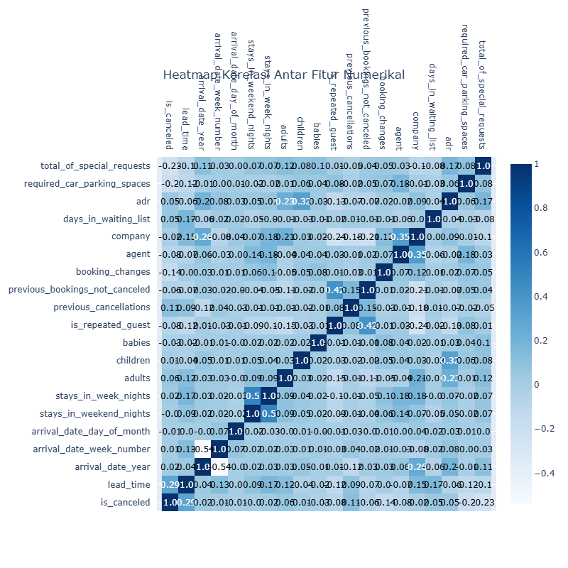

# Laporan Proyek Machine Learning - Arum Puspadewi

## Domain Proyek

Sudah tidak dapat dimungkiri lagi bahwa pembatalan reservasi oleh pelanggan merupakan salah satu tantangan utama dalam industri perhotelan yang dapat menimbulkan kerugian finansial dan gangguan operasional. Seiring dengan meningkatnya jumlah pemesanan online, penting untuk memprediksi apakah reservasi akan dibatalkan, agar pihak hotel bisa mengambil langkah proaktif seperti overbooking atau promosi ulang. Oleh karena itu, berbagai penelitian telah dilakukan untuk membangun sistem prediksi yang andal dengan memanfaatkan teknik pembelajaran mesin.

Salah satu penelitian terbaru dilakukan oleh Bhardwaj et al. (2024), yang mengembangkan sistem prediksi pembatalan reservasi hotel menggunakan berbagai teknik machine learning seperti Logistic Regression, Decision Tree, Random Forest, Gradient Boosting, SVM, dan Artificial Neural Network (ANN). Mereka menunjukkan bahwa ANN menghasilkan performa terbaik dengan akurasi 99,02%, sehingga sistem ini dapat diintegrasikan secara real-time untuk membantu manajemen hotel dalam pengambilan keputusan operasional secara data-driven. [1]

Penelitian serupa juga dilakukan oleh Qureshi dan Menezes (2023), yang menggunakan algoritma J48 Tree, Naive Bayes, Logistic Function, dan Random Forest melalui platform Weka. Hasil penelitian mereka menyimpulkan bahwa algoritma Random Forest adalah yang paling sesuai dalam memprediksi pembatalan berdasarkan metrik evaluasi seperti akurasi, sensitivitas, dan lift. [3]

Sementara itu, Satu et al. (2020) fokus pada analisis performa berbagai teknik machine learning dengan melakukan transformasi fitur dan seleksi fitur terlebih dahulu. Studi mereka menunjukkan bahwa XGBoost merupakan metode yang paling konsisten memberikan hasil terbaik, terutama saat dikombinasikan dengan teknik seleksi fitur berbasis information gain. [2]

Ketiga penelitian tersebut memperkuat pentingnya pendekatan machine learning dalam memahami dan mengelola risiko pembatalan reservasi hotel secara efektif.

## Business Understanding

### Problem Statements

- Apakah pelanggan akan membatalkan reservasi hotelnya?
- Fitur apa yang paling memengaruhi pembatalan reservasi?
- Bagaimana cara meningkatkan akurasi prediksi pembatalan?

### Goals

- Memprediksi probabilitas pembatalan pemesanan.
- Mengidentifikasi fitur paling berpengaruh dalam keputusan pembatalan.
- Menemukan model prediktif terbaik.

### Solution Statements

- Melakukan prediksi dengan algoritma machine learning.
- Mengukur performa dengan akurasi, precision, recall, dan F1-score.
- Menggunakan beragam algoritma (Random Forest, ANN, dan XGBoost).

## Data Understanding
Dataset ini berisi 119.390 data dengan 32 fitur yang berupa informasi pemesanan untuk hotel kota dan hotel resor, dan mencakup informasi seperti waktu pemesanan, lama menginap, jumlah orang dewasa, anak-anak, dan/atau bayi, serta jumlah tempat parkir yang tersedia. [Hotel booking demand](https://www.kaggle.com/datasets/jessemostipak/hotel-booking-demand). 

Beberapa poin penting mengenai kondisi awal dataset terebut:
- **Tipe Data**
  - 20 Fitur Numerikal, yaitu:
    -  ```is_canceled```
    -  ```lead_time```
    -  ```arrival_date_year```
    -  ```arrival_date_week_number```
    -  ```arrival_date_day_of_month```
    -  ```stays_in_weekend_nights```
    -  ```stays_in_week_nights```
    -  ```adults```
    -  ```children```
    -  ```babies```
    -  ```is_repeated_guest```
    -  ```previous_cancellations```
    -  ```previous_bookings_not_canceled```
    -  ```booking_changes```
    -  ```agent```
    -  ```company```
    -  ```days_in_waiting_list```
    -  ```adr```
    -  ```required_car_parking_spaces```
    -  ```total_of_special_requests```
  - 12 Fitur Kategorikal, yaitu:
    -  ```hotel```
    -  ```arrival_date_month```
    -  ```meal```
    -  ```country```
    -  ```market_segment```
    -  ```distribution_channel```
    -  ```reserved_room_type```
    -  ```assigned_room_type```
    -  ```deposit_type```
    -  ```customer_type```
    -  ```reservation_status ```
    -  ```reservation_status_date```

- **Missing Values**
  - Kolom ```children``` memiliki 4 nilai kosong (sedikit). Karena umumnya lebih sering tamu jarang membawa anak, maka nilai kosong pada kolom tersebut akan diisi nol.
  - Kolom ```country``` memiliki 488 nilai kosong (sedikit), sehingga nilai kosong pada kolom ```country``` akan diisi oleh nilai dengan jumlah terbanyak.
  - Kolom ```agent``` memiliki 16.340 nilai kosong (cukup banyak), sehingga fitur dipertimbangkan untuk dihapus.
  - Kolom ```company``` memiliki 112.593 nilai kosong (cukup banyak), sehingga fitur dipertimbangkan untuk dihapus.

- **Data Duplikat**
  
  Ditemukan sebanyak 3.195 baris duplikat dalam data.

- **Data Outlier**

  Ditemukan adanya outlier pada beberapa fitur, yaitu:
  - ```lead_time```: 3005
  - ```stays_in_weekend_nights```: 265
  - ```stays_in_week_nights```: 3354
  - ```adults```: 29710
  - ```children```: 8590
  - ```babies```: 917
  - ```is_repeated_guest```: 3810
  - ```previous_cancellations```: 6484
  - ```previous_bookings_not_canceled```: 3620
  - ```booking_changes```: 18076
  - ```days_in_waiting_list```: 3698
  - ```adr```: 3793
  - ```required_car_parking_spaces```: 7416
  - ```total_of_special_requests```: 2877

### Variabel-variabel pada Hotel booking demand dataset adalah sebagai berikut:
- hotel : Jenis Penginapan (H1 = Hotel Resor or H2 = Hotel Kota)
- is_canceled : Nilai yang menunjukkan apakah pemesanan dibatalkan (1) atau tidak (0)
- lead_time : Jumlah hari yang telah berlalu antara tanggal masuknya pemesanan ke dalam PMS dan tanggal kedatangan
- arrival_date_year : Tahun dari tanggal kedatangan
- arrival_date_month : Bulan dari tanggal kedatangan
- arrival_date_week_number : Minggu dari tanggal kedatangan
- arrival_date_day_of_month : Hari dari tanggal kedatangan
- stays_in_weekend_nights : Jumlah malam akhir pekan (Sabtu atau Minggu) tamu menginap atau memesan untuk menginap di hotel
- stays_in_week_nights : Jumlah malam dalam seminggu (Senin hingga Jumat) tamu menginap atau memesan untuk menginap di hotel
- adults : Jumlah orang dewasa
- children : Jumlah anak-anak
- babies : Jumlah bayi
- meal : Jenis makanan yang dipesan. Kategori disajikan dalam paket makanan standar perhotelan: Tidak ditentukan/SC - tidak ada paket makanan; BB - Tempat Tidur & Sarapan; HB - Setengah harga (sarapan dan satu kali makan lainnya - biasanya makan malam); FB - Harga penuh (sarapan, makan siang, dan makan malam)
- country : Negara asal. Kategori diwakili dalam format ISO 3155-3:2013
- market_segment : Penunjukan segmen pasar. Dalam kategori, istilah “TA” berarti “Agen Perjalanan” dan ‘TO’ berarti “Operator Tur”
- distribution_channel : Saluran distribusi pemesanan. Istilah “TA” berarti “Agen Perjalanan” dan ‘TO’ berarti “Operator Tur”
- is_repeated_guest : Nilai yang menunjukkan apakah nama pemesanan berasal dari tamu berulang (1) atau tidak (0)
- previous_cancellations : Jumlah pemesanan sebelumnya yang dibatalkan oleh pelanggan sebelum pemesanan saat ini
- previous_bookings_not_canceled : Jumlah pemesanan sebelumnya yang tidak dibatalkan oleh pelanggan sebelum pemesanan saat ini
- reserved_room_type : Kode jenis kamar yang dipesan. Kode disajikan sebagai pengganti sebutan untuk alasan anonimitas.
- assigned_room_type : Kode untuk jenis kamar yang ditetapkan untuk pemesanan. Terkadang jenis kamar yang ditetapkan berbeda dengan jenis kamar yang dipesan karena alasan operasional hotel (misalnya pemesanan berlebih) atau atas permintaan pelanggan. Kode disajikan sebagai pengganti sebutan untuk alasan anonimitas.
- booking_changes : Jumlah perubahan/amandemen yang dilakukan pada pemesanan sejak pemesanan dimasukkan pada PMS hingga saat check-in atau pembatalan
- deposit_type : Indikasi apakah pelanggan melakukan deposit untuk menjamin pemesanan. Variabel ini dapat memiliki tiga kategori: Tanpa Deposit - tidak ada deposit yang dilakukan; Non Refund - deposit yang dilakukan senilai total biaya menginap; Dapat Dikembalikan - deposit yang dilakukan dengan nilai di bawah total biaya menginap.
- agent : ID biro perjalanan yang melakukan pemesanan
- company : ID perusahaan/entitas yang melakukan pemesanan atau yang bertanggung jawab untuk membayar pemesanan. ID ditampilkan sebagai pengganti sebutan untuk alasan anonimitas
- days_in_waiting_list : Jumlah hari pemesanan berada dalam daftar tunggu sebelum dikonfirmasi kepada pelanggan
- customer_type : Jenis pemesanan, dengan asumsi salah satu dari empat kategori: Kontrak - ketika pemesanan memiliki jatah atau jenis kontrak lain yang terkait dengannya; Grup - ketika pemesanan terkait dengan grup; Transien - ketika pemesanan bukan bagian dari grup atau kontrak, dan tidak terkait dengan pemesanan transien lainnya; Transien-pihak - ketika pemesanan bersifat transien, tetapi terkait dengan setidaknya pemesanan transien lainnya
- adr : Tarif Harian Rata-Rata yang ditentukan dengan membagi jumlah semua transaksi penginapan dengan jumlah total malam menginap
- required_car_parking_spaces : Jumlah ruang parkir mobil yang dibutuhkan oleh pelanggan
- total_of_special_requests : Jumlah permintaan khusus yang dibuat oleh pelanggan (misalnya tempat tidur kembar atau lantai tinggi)
- reservation_status : Status terakhir pemesanan, dengan asumsi salah satu dari tiga kategori: Dibatalkan - pemesanan dibatalkan oleh pelanggan; Check-Out - pelanggan telah melakukan check-in namun sudah berangkat; Tidak Datang - pelanggan tidak melakukan check-in dan menginformasikan alasannya kepada hotel
- reservation_status_date : Tanggal saat status terakhir ditetapkan. Variabel ini dapat digunakan bersama dengan ReservationStatus untuk memahami kapan pemesanan dibatalkan atau kapan pelanggan check-out dari hotel

### Exploratory Data Analysis
Untuk memahami karakteristik data secara menyeluruh, dilakukan serangkaian tahapan eksplorasi data (Exploratory Data Analysis/EDA).

#### Distribusi Target (is Canceled)
Distribusi nilai target `is_canceled` menunjukkan bahwa sebagian besar reservasi tidak dibatalkan (0), namun terdapat proporsi signifikan yang dibatalkan (1). Ketidakseimbangan ini penting untuk diperhatikan dalam pemodelan prediktif.


#### Heatmap Korelasi Fitur Numerikal
Heatmap ini menunjukkan hubungan korelasi antar fitur numerik.



#### Distribusi Lead Time
Distribusi `lead_time` menunjukkan bahwa mayoritas reservasi dilakukan dalam waktu singkat sebelum tanggal kedatangan, namun terdapat sejumlah besar outlier pada nilai yang tinggi.


#### Distribusi ADR (Average Daily Rate)
Gambar berikut menunjukkan penyebaran nilai `adr`. Terlihat adanya sekelompok outlier dengan nilai ekstrem yang mungkin perlu diproses lebih lanjut.


#### Distribusi Total of Special Requests
Mayoritas tamu tidak memiliki permintaan khusus, sementara sebagian kecil meminta satu atau dua permintaan tambahan. Semakin banyak permintaan khusus, umumnya menunjukkan niat menginap yang lebih tinggi.


#### Distribusi Jenis Hotel
Dataset mencakup dua jenis hotel: City Hotel dan Resort Hotel. City Hotel lebih mendominasi dalam jumlah reservasi, namun keduanya perlu dianalisis secara terpisah karena karakteristik pengunjung dan tingkat pembatalannya bisa berbeda.


#### Distribusi Meal
Sebagian besar pelanggan memilih paket "BB" (bed and breakfast), dengan variasi kecil pada jenis meal lainnya. Preferensi meal dapat merefleksikan motivasi kunjungan dan dapat berpengaruh terhadap pembatalan.


#### Distribusi Channel
Kanal distribusi "TA/TO" (travel agents/tour operators) paling sering digunakan, diikuti oleh kanal langsung. Kanal distribusi bisa menunjukkan tingkat loyalitas atau kepastian pelanggan.


#### Distribusi Market Segment
Sebagian besar reservasi berasal dari segmen "Online TA", yang menunjukkan dominasi pemesanan online. Segmentasi ini penting untuk analisis risiko karena pelanggan online cenderung memiliki perilaku pembatalan yang berbeda dibandingkan pelanggan korporat atau offline.


## Data Preparation
Pada tahap ini, dilakukan serangkaian teknik data preparation untuk memastikan data bersih, relevan, dan siap digunakan untuk proses pemodelan. Berikut adalah tahapan yang dilakukan:

1. **Penghapusan Duplikasi:**
   Baris duplikat dihapus untuk menghindari bias.

2. **Penghapusan Kolom Tidak Relevan:**
   - `agent`, karena banyak nilai kosong.
   - `company`, karena banyak nilai kosong.
   - `arrival_date_year`, karena umumnya tidak terlalu berkontribusi pada pembatalan.
   - `arrival_date_week_number`, karena umumnya tidak terlalu berkontribusi pada pembatalan.
   - `arrival_date_day_of_month`, karena umumnya tidak terlalu berkontribusi pada pembatalan.
   - `booking_changes`, karena bisa menyebabkan kebocoran (data leakage).

3. **Penanganan Missing Values:**
   - Kolom `children` diisi dengan 0 karena kemungkinan besar merupakan input kosong (tanpa anak).
   - Kolom `country` diisi dengan modus (nilai yang paling sering muncul) karena nilai tersebut kemungkinan besar representatif.

3. **Penanganan Outlier:**
   - Outlier pada `adults` yang memiliki nilai di atas 10 ditangani dengan drop karena dirasa tidak masuk akal.
   - Outlier dari `lead_time`, `adr`, dan `days_in_waiting_list` ditangani dengan winsorizing karena nilainya masih relevan secara kontekstual.
   - Outlier dari `stays_in_week_nights`, `stays_in_weekend_nights`, `adults`, `children`, dan `babies` ditangani dengan threshold IQR karena distribusi sangat skewed dan banyak nol sehingga digunakan capping untuk mempertahankan data.

4. **Membuat Fitur Baru:**
   - Fitur `total_guests` dibuat dari penjumlahan `adults`, `children`, dan `babies`. Baris dengan total tamu = 0 dibuang karena tidak logis.
   - Fitur `room_type_changed` dibuat dari perbedaan tipe kamar yang direservasi dan diberikan berbeda.

5. **Encoding Fitur Kategorikal:**
   Label Encoding dilakukan terhadap fitur bertipe objek untuk mengubah kategori menjadi nilai numerik.

6. **Definisi fitur dan label:**
   Menggabungkan fitur ke `X` dan meletakkan label ke `y`.

7. **Scaling data:**
   `StandardScaler` digunakan untuk menormalkan fitur numerik agar skala data seragam, terutama penting untuk model ANN.

8. **Split Data:**
   Data dibagi menjadi 80% data latih dan 20% data uji menggunakan `train_test_split` dengan stratifikasi terhadap target untuk menjaga distribusi kelas.

## Modeling
Pada tahap ini, tiga algoritma machine learning yang berbeda diimplementasikan dan dievaluasi untuk memprediksi pembatalan reservasi hotel. Fitur-fitur yang telah dipersiapkan pada tahap Data Preparation digunakan sebagai input untuk model-model ini. Variabel target adalah `is_canceled`.

### 1. Random Forest Classifier
Random Forest adalah algoritma *ensemble learning* yang bekerja dengan membangun sejumlah besar pohon keputusan (decision trees) pada berbagai sub-sampel dari dataset dan menggunakan modus (untuk klasifikasi) dari prediksi masing-masing pohon untuk prediksi akhir.

- **Cara Kerja:**
    1.  Membuat *bootstrap samples* (sampel acak dengan penggantian) dari data latih.
    2.  Untuk setiap *bootstrap sample*, sebuah pohon keputusan dibangun. Saat membangun pohon, pada setiap simpul (node), hanya sebagian kecil fitur yang dipilih secara acak untuk dipertimbangkan dalam mencari pemisahan terbaik.
    3.  Setelah semua pohon dibangun, untuk prediksi data baru, setiap pohon memberikan klasifikasi. Kelas yang paling banyak dipilih (voting mayoritas) oleh pohon-pohon menjadi prediksi akhir dari Random Forest.
- **Parameter Utama yang Digunakan:**
    - `n_estimators=100`: Jumlah pohon keputusan yang dibangun dalam hutan.
    - `random_state=42`: Untuk memastikan hasil yang dapat direproduksi.
- **Kelebihan:** Cukup robust terhadap *overfitting*, mampu menangani data dengan baik, dan dapat memberikan ukuran *feature importance*.
- **Kekurangan:** Bisa menjadi *black box* (sulit diinterpretasi secara detail bagaimana keputusan dibuat).

### 2. XGBoost Classifier
XGBoost (Extreme Gradient Boosting) adalah implementasi yang dioptimalkan dari algoritma *gradient boosting*. Ini adalah teknik *ensemble* yang kuat dan sering digunakan untuk mencapai performa tinggi.

- **Cara Kerja:**
    1.  XGBoost membangun model (pohon keputusan) secara aditif dan sekuensial.
    2.  Model pertama dilatih pada seluruh data. Kemudian, model kedua dilatih untuk memperbaiki kesalahan (residu) dari model pertama. Proses ini berlanjut, di mana setiap pohon baru mencoba mengoreksi kesalahan kumulatif dari pohon-pohon sebelumnya.
    3.  Menggunakan teknik regularisasi (L1 dan L2) untuk mencegah *overfitting*.
- **Parameter Utama yang Digunakan:**
    - `use_label_encoder=False`: Untuk menonaktifkan penggunaan otomatis `LabelEncoder` oleh XGBoost, sesuai dengan praktik terbaru.
    - `eval_metric='logloss'`: Metrik yang digunakan untuk evaluasi selama proses *training* jika set validasi disediakan. *Logloss* adalah metrik yang baik untuk klasifikasi biner.
    - Parameter lain menggunakan nilai default dari library XGBoost.
- **Kelebihan:** Performa sangat tinggi, efisiensi komputasi yang baik, fleksibilitas dalam tuning parameter.
- **Kekurangan:** Lebih banyak parameter untuk di-tuning, bisa rentan *overfitting* jika tidak di-tuning dengan hati-hati.

### 3. Artificial Neural Network (ANN)
Artificial Neural Network (ANN) adalah model yang terinspirasi dari struktur jaringan saraf biologis. ANN terdiri dari lapisan-lapisan neuron yang saling terhubung, di mana setiap koneksi memiliki bobot yang dapat disesuaikan.

- **Cara Kerja:**
    1.  Data input dimasukkan ke *input layer*.
    2.  Setiap neuron di *hidden layer* menerima input dari neuron di layer sebelumnya, mengalikannya dengan bobot koneksi, menjumlahkannya, menambahkan bias, dan kemudian meneruskannya melalui fungsi aktivasi.
    3.  Proses ini berlanjut melalui semua *hidden layer* hingga mencapai *output layer*, yang menghasilkan prediksi akhir.
    4.  Selama pelatihan, bobot disesuaikan menggunakan algoritma optimasi (seperti Adam) dan *backpropagation* untuk meminimalkan fungsi kerugian (*loss function*).
- **Arsitektur dan Konfigurasi yang Digunakan:**
    - Model dibangun menggunakan Keras `Sequential` API.
    - **Input Layer:** Implisit ditentukan oleh `input_shape=(X_train.shape[1],)` pada layer Dense pertama.
    - **Hidden Layers:**
        - Layer 1: `Dense(256, activation='relu')`
            - `Dense`: Layer *fully connected* dengan 256 unit/neuron.
            - `activation='relu'`: Fungsi aktivasi ReLU (Rectified Linear Unit), $f(x) = \max(0, x)$. Membantu mengatasi *vanishing gradient problem* dan komputasinya cepat.
        - `BatchNormalization()`: Menormalisasi output dari layer sebelumnya. Mempercepat konvergensi, menstabilkan pembelajaran, dan memiliki efek regularisasi ringan.
        - `Dropout(0.4)`: Secara acak menonaktifkan 40% unit input selama iterasi pelatihan untuk mencegah *overfitting*.
        - Layer 2: `Dense(128, activation='relu')`, diikuti `BatchNormalization()`, dan `Dropout(0.4)`.
        - Layer 3: `Dense(64, activation='relu')`, diikuti `BatchNormalization()`, dan `Dropout(0.3)`.
        - Layer 4: `Dense(32, activation='relu')`, diikuti `Dropout(0.2)`.
    - **Output Layer:**
        - `Dense(1, activation='sigmoid')`: Layer output dengan 1 unit/neuron.
        - `activation='sigmoid'`: Fungsi aktivasi Sigmoid, $f(x) = 1 / (1 + e^{-x})$, menghasilkan output antara 0 dan 1. Cocok untuk klasifikasi biner sebagai probabilitas kelas positif.
- **Kompilasi Model:**
    - `optimizer='adam'`: Algoritma optimasi Adam, efisien dan adaptif.
    - `loss='binary_crossentropy'`: Fungsi kerugian untuk klasifikasi biner, mengukur perbedaan antara distribusi probabilitas aktual dan prediksi.
    - `metrics=['accuracy']`: Akurasi dipantau selama pelatihan dan evaluasi.
- **Pelatihan:**
    - `epochs=50`, `batch_size=64`, `validation_split=0.2`.
    - `EarlyStopping(monitor='val_loss', patience=5, restore_best_weights=True)`: Menghentikan pelatihan jika `val_loss` tidak membaik selama 5 epoch berturut-turut, dan mengembalikan bobot terbaik untuk mencegah *overfitting*.
- **Kelebihan:** Kemampuan mempelajari pola kompleks dan non-linear.
- **Kekurangan:** Membutuhkan banyak data, sensitif terhadap penskalaan fitur, bisa menjadi *black box*, risiko *overfitting* jika tidak dikelola baik.

### Pemilihan Model Terbaik
Setelah dibandingkan berdasarkan metrik evaluasi (lihat bagian Evaluasi), **Random Forest** dipilih sebagai model terbaik untuk kasus ini. Meskipun semua model menunjukkan performa yang kompetitif, Random Forest memberikan F1-score yang sedikit lebih tinggi untuk prediksi kelas pembatalan (`is_canceled`) dan keseimbangan yang baik antara precision dan recall untuk kelas tersebut.

## Evaluation

### Metrik Evaluasi:
Karena permasalahan merupakan klasifikasi biner (apakah pemesanan dibatalkan atau tidak), digunakan metrik berikut:

- **Accuracy**: Proporsi prediksi yang benar terhadap seluruh data.
    ```math
  \text{Accuracy} = \frac{\text{TP} + \text{TN}}{\text{TP} + \text{TN} + \text{FP} + \text{FN}}
  ```
- **Precision**: Proporsi prediksi positif yang benar-benar positif.
  ```math
  \text{Precision} = \frac{\text{TP}}{\text{TP} + \text{FP}}
  ```
- **Recall**: Proporsi data positif yang berhasil diprediksi dengan benar.
  ```math
  \text{Recall} = \frac{\text{TP}}{\text{TP} + \text{FN}}
  ```
- **F1 Score**: Harmonik rata-rata precision dan recall, cocok untuk data tidak seimbang.
  ```math
  \text{F1} = 2 \cdot \frac{\text{Precision} \cdot \text{Recall}}{\text{Precision} + \text{Recall}}
  ```

### Hasil Evaluasi:
Berikut adalah ringkasan performa model pada data uji, dengan fokus pada metrik untuk kelas `is_canceled = 1` (pembatalan) dan akurasi keseluruhan:

| Model         | Accuracy | Precision | Recall   | F1 Score |
|---------------|----------|-----------|----------|----------|
| Random Forest | **0.84** | **0.83**  | **0.84** | **0.83** |
| XGBoost       | 0.83     | 0.83      | 0.83     | 0.83     |
| ANN           | 0.82     | 0.81      | 0.82     | 0.82     |

### Interpretasi:

#### Random Forest
- F1 Score untuk prediksi pembatalan adalah **0.83**, yang menunjukkan keseimbangan terbaik antara precision dan recall untuk mengidentifikasi pembatalan.
- Precision sekitar **0.83**: Dari semua reservasi yang diprediksi akan batal oleh model ini, sekitar **83%** di antaranya memang benar-benar batal.
- Recall sekitar **0.84**: Model ini berhasil mengidentifikasi sekitar **84%** dari semua reservasi yang seharusnya batal.
- Model ini menunjukkan performa paling stabil dan andal di semua metrik yang relevan untuk target bisnis.

#### XGBoost
- Menunjukkan performa yang baik, dengan F1 Score **0.83**.
- Precision sekitar **0.83** dan Recall sekitar **0.83**.
- Meskipun sedikit di bawah Random Forest pada metrik utama, XGBoost tetap merupakan model yang kuat dan bisa menjadi alternatif dengan tuning lebih lanjut.

#### ANN
- Performa sedikit di bawah dua model berbasis pohon, dengan F1 Score **0.82**.
- Recall sekitar **0.82**, menunjukkan bahwa model ini mungkin melewatkan lebih banyak kasus pembatalan aktual dibandingkan dua model lainnya.

### Fitur Penting
Analisis *feature importance* dilakukan untuk setiap model untuk memahami faktor-faktor mana yang paling berpengaruh dalam prediksi pembatalan. Berikut adalah ringkasan fitur-fitur teratas (Top 5) dari masing-masing model:

| Peringkat | Random Forest                 | XGBoost                          | ANN (Permutation Importance)  |
|-----------|-------------------------------|----------------------------------|-------------------------------|
| 1         | `lead_time`                   | `required_car_parking_spaces`    | `total_of_special_requests`   |
| 2         | `adr`                         | `room_type_changed`              | `lead_time`                   |
| 3         | `country`                     | `deposit_type`                   | `country`                     |
| 4         | `arrival_date_month`          | `market_segment`                 | `market_segment`              |
| 5         | `stays_in_week_nights`        | `total_of_special_requests`      | `room_type_changed`           |
| 6         | `total_of_special_requests`   | `previous_cancellations`         | `required_car_parking_spaces` |
| 7         | `market_segment`              | `country`                        | `adr`                         |
| 8         | `stays_in_weekend_nights`     | `customer_type`                  | `customer_type`               |
| 9         | `room_type_changed`           | `lead_time`                      | `hotel`                       |
| 10        | `required_car_parking_spaces` | `previous_bookings_not_canceled` | `previous_cancellations`      |

Fitur seperti `lead_time`, `country`, `total_of_special_requests`, `market_segment`, `required_car_parking_spaces`, dan `room_type_changed` secara konsisten muncul sebagai faktor penting di berbagai model, menunjukkan relevansi mereka yang kuat terhadap prediksi pembatalan.

### Keterkaitan Hasil Evaluasi dengan Business Understanding

Evaluasi model yang telah dilakukan tidak hanya menghasilkan metrik performa, tetapi juga memberikan wawasan yang relevan dengan tujuan bisnis dan masalah yang ingin dipecahkan.

**1. Menjawab Problem Statements:**
   - **"Apakah pelanggan akan membatalkan reservasi hotelnya?"**
     Model yang dikembangkan, khususnya Random Forest dengan F1-score sekitar **0.83** untuk prediksi pembatalan, menunjukkan kemampuan yang baik dalam memprediksi kemungkinan pelanggan akan membatalkan reservasi. Ini memberikan alat bagi hotel untuk mengantisipasi pembatalan.
   - **"Fitur apa yang paling memengaruhi pembatalan reservasi?"**
     Analisis *feature importance* dari ketiga model secara konsisten menunjukkan beberapa fitur kunci seperti `lead_time`, `country`, `total_of_special_requests`, `market_segment`, `required_car_parking_spaces`, dan `room_type_changed` memiliki pengaruh signifikan terhadap keputusan pembatalan. Informasi ini sangat berharga bagi hotel untuk memahami faktor-faktor risiko.
   - **"Bagaimana cara meningkatkan akurasi prediksi pembatalan?"**
     Dengan mengembangkan dan membandingkan tiga model machine learning yang berbeda, proyek ini telah mengeksplorasi cara untuk mendapatkan prediksi yang akurat dan seimbang. Pemilihan Random Forest sebagai model terbaik menunjukkan langkah konkret dalam mencapai performa yang lebih baik dibandingkan jika hanya menggunakan satu model atau pendekatan sederhana.

**2. Pencapaian Goals Proyek:**
   - **"Memprediksi probabilitas pembatalan pemesanan."**
     Tercapai. Model klasifikasi yang dibangun (terutama output dari ANN dengan fungsi sigmoid, atau metode `predict_proba` pada Random Forest dan XGBoost) dapat menghasilkan skor probabilitas yang dapat digunakan untuk menilai risiko pembatalan setiap reservasi.
   - **"Mengidentifikasi fitur paling berpengaruh dalam keputusan pembatalan."**
     Tercapai. Hasil analisis *feature importance* telah disajikan dan diinterpretasi, memberikan pemahaman mengenai faktor-faktor utama yang mendorong pembatalan.
   - **"Menemukan model prediktif terbaik."**
     Tercapai. Melalui evaluasi komparatif, Random Forest diidentifikasi sebagai model dengan performa terbaik di antara yang diuji, berdasarkan F1-score untuk kelas target.

**3. Dampak Solusi yang Direncanakan:**
   - **"Melakukan prediksi dengan algoritma machine learning."**
     Solusi ini telah berhasil diimplementasikan. Model-model machine learning mampu mempelajari pola dari data historis untuk membuat prediksi.
   - **"Mengukur performa dengan akurasi, precision, recall, dan F1-score."**
     Solusi ini telah berhasil diterapkan. Metrik-metrik tersebut memberikan ukuran kuantitatif mengenai seberapa baik model bekerja.
   - **"Menggunakan beragam algoritma (Random Forest, ANN, dan XGBoost)."**
     Solusi ini telah berhasil dilaksanakan, memungkinkan perbandingan dan pemilihan model yang paling sesuai.

   **Dampak Bisnis yang Dihasilkan:**
   Dengan kemampuan model (misalnya, Random Forest) untuk memprediksi pembatalan, hotel dapat memperoleh manfaat bisnis yang signifikan:
   - **Manajemen Risiko yang Lebih Baik:** Hotel dapat mengidentifikasi reservasi berisiko tinggi lebih awal. Hal ini memungkinkan tindakan proaktif, seperti menerapkan strategi *overbooking* yang lebih cerdas dan terukur untuk kamar yang diprediksi akan kosong, sehingga memaksimalkan okupansi dan pendapatan.
   - **Optimalisasi Pendapatan:** Dengan prediksi yang lebih akurat, hotel dapat mengurangi kerugian akibat pembatalan mendadak. Jika reservasi diprediksi batal, kamar tersebut dapat ditawarkan kembali ke pasar lebih cepat.
   - **Peningkatan Pengalaman Tamu (Potensial):** Untuk reservasi yang diprediksi tidak batal dan memiliki permintaan khusus (`total_of_special_requests` sebagai fitur penting), hotel dapat lebih fokus memastikan permintaan tersebut terpenuhi.
   - **Strategi Pemasaran dan Kebijakan yang Lebih Tepat Sasaran:** Pemahaman fitur penting seperti `market_segment` tertentu menunjukkan tingkat pembatalan tinggi, strategi khusus dapat dirancang untuk segmen tersebut.
   Secara keseluruhan, implementasi model prediktif ini memberikan landasan bagi pengambilan keputusan yang lebih *data-driven* dalam operasional hotel, yang berpotensi meningkatkan efisiensi dan profitabilitas.


## Referensi

[1] A. Bhardwaj, T. Yadav, and R. Chaudhary, "Predicting Hotel Booking Cancellations using Machine Learning Techniques," *2024 15th International Conference on Computing Communication and Networking Technologies (ICCCNT)*, Kamand, India, 2024, pp. 1–6. [doi:10.1109/ICCCNT61001.2024.10725148](https://doi.org/10.1109/ICCCNT61001.2024.10725148)

[2] M. S. Satu, K. Ahammed, and M. Z. Abedin, "Performance Analysis of Machine Learning Techniques to Predict Hotel booking Cancellations in Hospitality Industry," *2020 23rd International Conference on Computer and Information Technology (ICCIT)*, Dhaka, Bangladesh, 2020, pp. 1–6. [doi:10.1109/ICCIT51783.2020.9392648](https://doi.org/10.1109/ICCIT51783.2020.9392648)

[3] S. Qureshi and J. Menezes, "Prediction of hotel booking cancellation using machine learning algorithms," *7th IET Smart Cities Symposium (SCS 2023)*, Hybrid Conference, Bahrain, 2023, pp. 140–145. [doi:10.1049/icp.2024.0914](https://doi.org/10.1049/icp.2024.0914)
